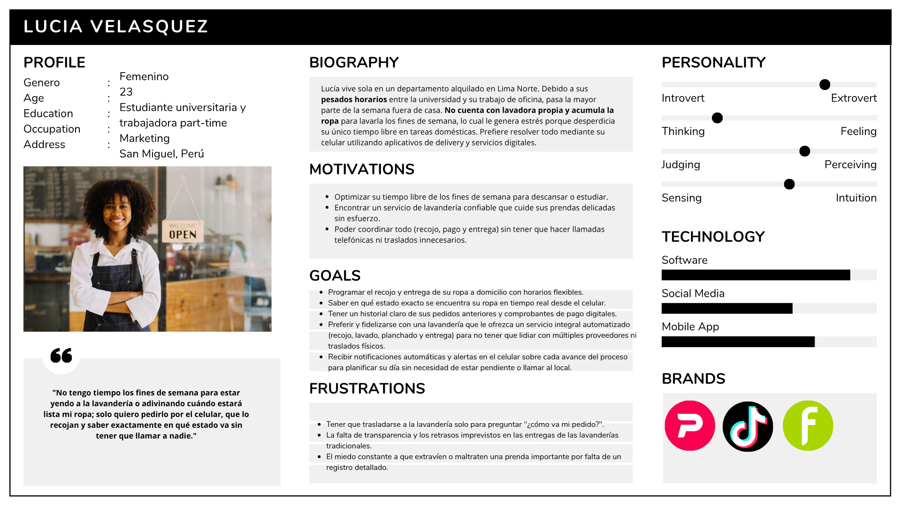
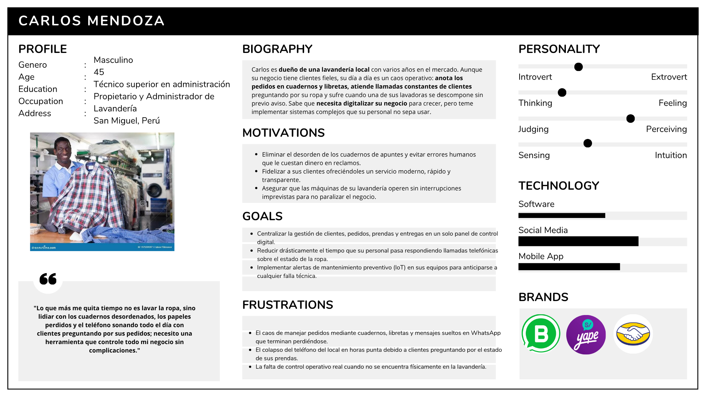
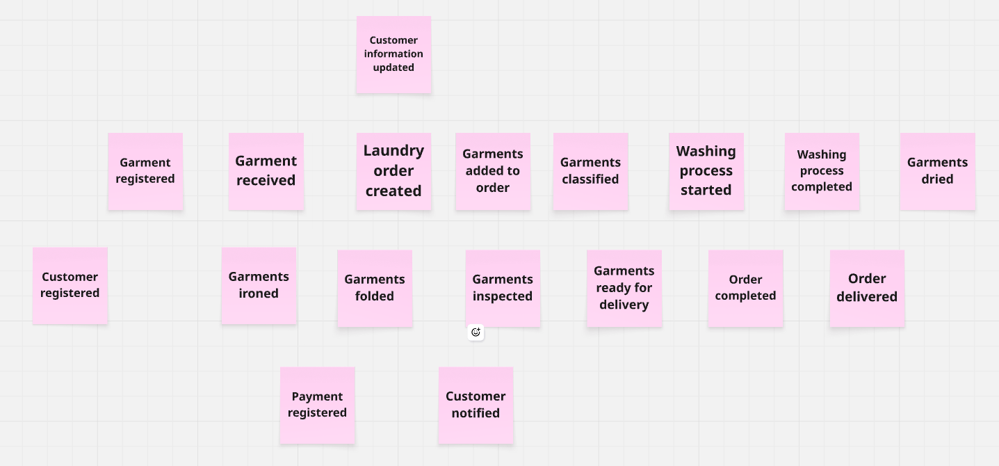
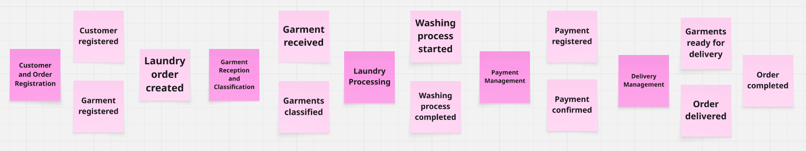
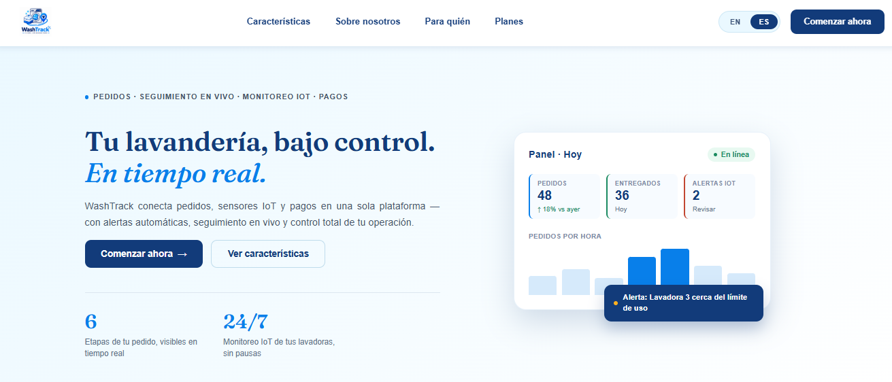

<h2><b>Universidad Peruana de Ciencias Aplicadas</b></h2>
<h3><b>Carrera de Ingeniería de Software</b></h3>
 

<h5>Curso: Desarrollo de Aplicaciones Open Source (1ASI0729)</h5>

**NRC: 7769**
 

<h3><b>Informe del Trabajo Final</b></h3>

<h5>Docente: Hugo Allan Mori Paiva</h5>

**Equipo:** TechNova

**Proyecto:** WashTrack

 

<h3>Integrantes</h3>

<table align="center" style="border-collapse: collapse; border: none; margin-left: auto; margin-right: auto;">
    <tr>
        <th style="border: none; padding: 0 18px 6px 0; text-align: center;">Código</th>
        <th style="border: none; padding: 0 0 6px 0; text-align: center;">Apellidos y Nombres</th>
    </tr>
    <tr>
        <td style="border: none; padding: 0 18px 4px 0; text-align: center;">u202318220</td>
        <td style="border: none; padding: 0 0 4px 0; text-align: center;">Hermoza Quispe, Jude</td>
    </tr>
    <tr>
        <td style="border: none; padding: 0 18px 4px 0; text-align: center;">u20231b842</td>
        <td style="border: none; padding: 0 0 4px 0; text-align: center;">Mantilla Maldonado, Enrique Manuel</td>
    </tr>
    <tr>
        <td style="border: none; padding: 0 18px 4px 0; text-align: center;"></td>
        <td style="border: none; padding: 0 0 4px 0; text-align: center;"></td>
    </tr>
    <tr>
        <td style="border: none; padding: 0 18px 4px 0; text-align: center;">u202018427</td>
        <td style="border: none; padding: 0 0 4px 0; text-align: center;">Ramos Fuentes Rivera, Adriana Nicole</td>
    </tr>
    <tr>
        <td style="border: none; padding: 0 18px 0 0; text-align: center;"></td>
        <td style="border: none; padding: 0; text-align: center;"></td>
    </tr>
</table>

 

*Setiembre, 2026*

---

## Registro de Versiones

| Versión | Fecha      | Autor                         | Descripcion                                              |
| :--- |:-----------|:------------------------------|:---------------------------------------------------------|
| 1.0.0 | 06/09/2026 | Jude Hermoza | Insercion del documento base. |
| 1.1.0 | 06/09/2026 | Perez Vasquez Ariana Valeria | Student Outcome, Avance Capítulo 1, y NeedFinding, User Personas y User Task Matrix parte del Capítulo 4, como Landing Page.
---

## Project Report Collaboration Insights

// Enlaces  de repositorios

*Reporte de colaboración de la entrega del TP:*

// Falta Imagen 

---

# Contenido

## Tabla de Contenidos

- [Registro de Versiones del Informe](#registro-de-versiones-del-informe)
- [Project Report Collaboration Insights](#project-report-collaboration-insights)
- [Contenido](#contenido)
  - [Tabla de Contenidos](#tabla-de-contenidos)
- [Student Outcome](#student-outcome)
- [Capítulo I: Introducción](#capítulo-i-introducción)
  - [1.1. Startup Profile](#11-startup-profile)
    - [1.1.1. Descripción de la Startup](#111-descripción-de-la-startup)
    - [1.1.2. Perfiles de integrantes del equipo](#112-perfiles-de-integrantes-del-equipo)
  - [1.2. Solution Profile](#12-solution-profile)
    - [1.2.1. Antecedentes y problemática](#121-antecedentes-y-problemática)
    - [1.2.2. Lean UX Process](#122-lean-ux-process)
      - [1.2.2.1. Lean UX Problem Statements](#1221-lean-ux-problem-statements)
      - [1.2.2.2. Lean UX Assumptions](#1222-lean-ux-assumptions)
      - [1.2.2.3. Lean UX Hypothesis Statements](#1223-lean-ux-hypothesis-statements)
      - [1.2.2.4. Lean UX Canvas](#1224-lean-ux-canvas)
  - [1.3. Segmentos objetivo](#13-segmentos-objetivo)
- [Capítulo II: Requirements Elicitation \& Analysis](#capítulo-ii-requirements-elicitation--analysis)
  - [2.1. Competidores](#21-competidores)
    - [2.1.1. Análisis competitivo](#211-análisis-competitivo)
    - [2.1.2. Estrategias y tácticas frente a competidores](#212-estrategias-y-tácticas-frente-a-competidores)
  - [2.2. Entrevistas](#22-entrevistas)
    - [2.2.1. Diseño de entrevistas](#221-diseño-de-entrevistas)
    - [2.2.2. Registro de entrevistas](#222-registro-de-entrevistas)
    - [2.2.3. Análisis de entrevistas](#223-análisis-de-entrevistas)
  - [2.3. Needfinding](#23-needfinding)
    - [2.3.1. User Personas](#231-user-personas)
    - [2.3.2. User Task Matrix](#232-user-task-matrix)
    - [2.3.3. User Journey Mapping](#233-user-journey-mapping)
    - [2.3.4. Empathy Mapping](#234-empathy-mapping)
  - [2.4. Big Picture Event Storming](#24-big-picture-event-storming)
  - [2.5. Ubiquitous Language](#25-ubiquitous-language)
- [Capítulo III: Requirements Specification](#capítulo-iii-requirements-specification)
  - [3.1. User Stories](#31-user-stories)
  - [3.2. Impact Mapping](#32-impact-mapping)
  - [3.3. Product Backlog](#33-product-backlog)
- [Capítulo IV: Product Design](#capítulo-iv-product-design)
  - [4.1. Style Guidelines](#41-style-guidelines)
    - [4.1.1. General Style Guidelines](#411-general-style-guidelines)
    - [4.1.2. Web Style Guidelines](#412-web-style-guidelines)
  - [4.2. Information Architecture](#42-information-architecture)
    - [4.2.1. Organization Systems](#421-organization-systems)
    - [4.2.2. Labeling Systems](#422-labeling-systems)
    - [4.2.3. SEO Tags and Meta Tags](#423-seo-tags-and-meta-tags)
    - [4.2.4. Searching Systems](#424-searching-systems)
    - [4.2.5. Navigation Systems](#425-navigation-systems)
  - [4.3. Landing Page UI Design](#43-landing-page-ui-design)
    - [4.3.1. Landing Page Wireframe](#431-landing-page-wireframe)
    - [4.3.2. Landing Page Mock-up](#432-landing-page-mock-up)
  - [4.4. Web Applications UX/UI Design](#44-web-applications-uxui-design)
    - [4.4.1. Web Applications Wireframes](#441-web-applications-wireframes)
    - [4.4.2. Web Applications Wireflow Diagrams](#442-web-applications-wireflow-diagrams)
    - [4.4.3. Web Applications Mock-ups](#443-web-applications-mock-ups)
    - [4.4.4. Web Applications User Flow Diagrams](#444-web-applications-user-flow-diagrams)
  - [4.5. Web Applications Prototyping](#45-web-applications-prototyping)
  - [4.6. Domain-Driven Software Architecture](#46-domain-driven-software-architecture)
    - [4.6.1. Design-Level EventStorming](#461-design-level-eventstorming)
    - [4.6.2. Software Architecture Context Diagram](#462-software-architecture-context-diagram)
    - [4.6.3. Software Architecture Container Diagrams](#463-software-architecture-container-diagrams)
    - [4.6.4. Software Architecture Components Diagrams](#464-software-architecture-components-diagrams)
  - [4.7. Software Object-Oriented Design](#47-software-object-oriented-design)
    - [4.7.1. Class Diagrams](#471-class-diagrams)
  - [4.8. Database Design](#48-database-design)
    - [4.8.1. Database Diagrams](#481-database-diagrams)

- [Capítulo V: Product Implementation, Validation & Deployment](#capítulo-v-product-implementation-validation--deployment)
  - [5.1. Software Configuration Management](#51-software-configuration-management)
    - [5.1.1. Software Development Environment Configuration](#511-software-development-environment-configuration)
    - [5.1.2. Source Code Management](#512-source-code-management)
    - [5.1.3. Source Code Style Guide & Conventions](#513-source-code-style-guide--conventions)
    - [5.1.4. Software Deployment Configuration](#514-software-deployment-configuration)
  - [5.2. Landing Page, Services & Applications Implementation](#52-landing-page-services--applications-implementation)
    - [5.2.1. Sprint 1](#521-sprint-1)
      - [5.2.1.1. Sprint Planning 1](#5211-sprint-planning-1)
      - [5.2.1.2. Aspect Leaders and Collaborators](#5212-aspect-leaders-and-collaborators)
      - [5.2.1.3. Sprint Backlog 1](#5213-sprint-backlog-1)
      - [5.2.1.4. Development Evidence for Sprint Review](#5214-development-evidence-for-sprint-review)
      - [5.2.1.5. Execution Evidence for Sprint Review](#5215-execution-evidence-for-sprint-review)
      - [5.2.1.6. Services Documentation Evidence for Sprint Review](#5216-services-documentation-evidence-for-sprint-review)
      - [5.2.1.7. Software Deployment Evidence for Sprint Review](#5217-software-deployment-evidence-for-sprint-review)
      - [5.2.1.8. Team Collaboration Insights during Sprint](#5218-team-collaboration-insights-during-sprint)
  - [5.3. Validation Interviews](#53-validation-interviews)
    - [5.3.1. Diseño de Entrevistas](#531-diseño-de-entrevistas)
    - [5.3.2. Registro de Entrevistas](#532-registro-de-entrevistas)
    - [5.3.3. Evaluaciones según heurísticas](#533-evaluaciones-según-heurísticas)
  - [5.4. Video About-the-Product](#54-video-about-the-product)

- [Bibliografía](#bibliografía)

- [Anexos](#anexos)

---

# Student Outcome
El curso contribuye al cumplimiento del Student Outcome ABET:
**ABET – EAC – Student Outcome 3**

<b>Criterio: </b>

En el siguiente cuadro se describe las acciones realizadas y enunciados de conclusiones por parte del grupo, que permiten sustentar el haber alcanzado el logro del ABET–EAC–Student Outcome 3.

<table>
  <thead>
    <tr>
      <th>Criterio específico</th>
      <th>Acciones realizadas</th>
      <th>Conclusiones</th>
    </tr>
  </thead>
  <tbody>
    <tr>
      <td><strong>Comunica oralmente con efectividad a diferentes rangos de audiencia.</strong></td>
      <td>
        <b>Pérez Vásquez, Ariana Valeria</b> 
        <em><b>AV1</b></em> 
        Sustentación oral del Avance Capítulo 1 y los resultados iniciales de la investigación de usuarios (NeedFinding y definición de User Personas), argumentando la problemática encontrada ante el profesor y evaluadores de manera clara. 
        <em><b>AV2</b></em> 
        Sustentación y demostración síncrona de la User Task Matrix y las funcionalidades de la Landing Page desarrollada, explicando la propuesta de valor y el flujo de interacción inicial del usuario ante la audiencia. 
        ... 
        <b>Ramirez Gutierrez, Gabriel</b> 
        <em><b>AV1</b></em> 
        Poner avances av1 
        <em><b>AV2</b></em> 
        Poner avances av2 
        ... 
        <b>Ramos Fuentes Rivera, Adriana Nicole</b> 
        <em><b>AV1</b></em> 
        Poner avances av1 
        <em><b>AV2</b></em> 
        Poner avances av2 
        ... 
        <b>Sayago Vidal, Sebastián Leonardo</b> 
        <em><b>AV1</b></em> 
        Poner avances av1 
        <em><b>AV2</b></em> 
        Poner avances av2 
        ... 
        <b>Tufiño Argüelles, Luis Angel</b> 
        <em><b>AV1</b></em> 
        Poner avances av1 
        <em><b>AV2</b></em> 
        Poner avances av2 
        ... 
      </td>
      <td>
        Fusce cursus dolor et nulla suscipit, sit amet ullamcorper nibh vestibulum. 
        Nam ornare massa eu lobortis porttitor. 
        Nam ut erat feugiat libero pretium semper at ac metus. 
        Sed at eros dapibus, fermentum quam ut, bibendum lacus. 
        Curabitur eget orci eget urna varius commodo. 
        ...
      </td>
    </tr>
    <tr>
      <td><strong>Comunica por escrito con efectividad a diferentes rangos de audiencia.</strong></td>
      <td>
        <b>Pérez Vásquez, Ariana Valeria</b> 
        <em><b>AV1</b></em> 
       Redacción y documentación formal en formato Markdown del Avance Capítulo 1, detallando la contextualización del proyecto y la consolidación de la investigación de usuarios con las User Personas. 
        <em><b>AV2</b></em> 
        Estructuración y redacción escrita de la User Task Matrix y la documentación técnica de la Landing Page, especificando requerimientos, alcances y diseño preliminar en el repositorio. 
        ... 
        <b>Ramirez Gutierrez, Gabriel</b> 
        <em><b>AV1</b></em> 
        Poner avances av1 
        <em><b>AV2</b></em> 
        Poner avances av2 
        ... 
        <b>Ramos Fuentes Rivera, Adriana Nicole</b> 
        <em><b>AV1</b></em> 
        Poner avances av1 
        <em><b>AV2</b></em> 
        Poner avances av2 
        ... 
        <b>Sayago Vidal, Sebastián Leonardo</b> 
        <em><b>AV1</b></em> 
        Poner avances av1 
        <em><b>AV2</b></em> 
        Poner avances av2 
        ... 
        <b>Tufiño Argüelles, Luis Angel</b> 
        <em><b>AV1</b></em> 
        Poner avances av1 
        <em><b>AV2</b></em> 
        Poner avances av2 
        ... 
      </td>
      <td>
        Fusce mattis augue a nisl bibendum, quis fringilla neque scelerisque. 
        Vivamus commodo libero eget venenatis imperdiet. 
        Etiam imperdiet quam condimentum velit tempor porttitor. 
        Suspendisse blandit nisl quis mauris vehicula faucibus. 
        ...
      </td>
    </tr>
  </tbody>
</table>

---

## Capítulo I: Introducción

### 1.1. Startup Profile

#### 1.1.1. Descripción de la Startup

    Somos <b>TechNova</b>, una startup tecnológica creada por estudiantes de la <b>Universidad Peruana de Ciencias Aplicadas (UPC)</b>, enfocada en el diseño y desarrollo de soluciones digitales orientadas a optimizar y transformar la gestión de negocios tradicionales mediante la implementación de software. Nuestra startup busca facilitar la digitalización de procesos que actualmente se realizan de manera manual, permitiendo a los negocios mejorar su organización, reducir errores operacionales, optimizar sus tiempos de atención y ofrecer una mejor experiencia a sus usuarios.

    Nuestro producto principal es <b>WashTrack</b>, una plataforma digital orientada a la gestión integral de lavanderías. Esta solución permite tanto a los administradores como a los clientes registrar y administrar perfiles, gestionar pedidos y prendas de forma detallada, realizar un seguimiento en tiempo real del estado de cada servicio y mantener un registro histórico transparente de todas las operaciones realizadas.

    La <b>misión</b> de TechNova es desarrollar soluciones tecnológicas accesibles, intuitivas y eficientes que impulsen la transformación digital de los negocios tradicionales, optimizando su gestión operativa y elevando la calidad de la experiencia del cliente final.

    Nuestra <b>visión</b> es consolidarnos como una startup referente en el desarrollo de soluciones digitales para pequeñas y medianas empresas en Latinoamérica, destacando por plataformas escalables que simplifiquen las operaciones comerciales y generen un impacto positivo en el mercado.

    Nuestros <b>valores</b> principales son:
    <ul>
        <li><b>Innovación:</b> Desarrollar soluciones tecnológicas disruptivas que respondan de manera ágil a las necesidades actuales de los negocios y sus clientes.</li>
        <li><b>Compromiso:</b> Crear herramientas robustas enfocadas en resolver problemas reales y generar valor sostenible para nuestros usuarios.</li>
        <li><b>Accesibilidad:</b> Diseñar soluciones altamente usables, intuitivas y adaptadas a las capacidades tecnológicas de las pequeñas y medianas empresas.</li>
        <li><b>Transparencia:</b> Garantizar flujos claros y trazabilidad en toda la información relacionada con los procesos y pedidos de los clientes.</li>
    </ul>

#### 1.1.2. Perfiles de integrantes del equipo

<table>
  <tr>
    <td rowspan="4" align="center">
      
    </td>
    <td><b>Nombre:</b> Perez Vasquez Ariana Valeria</td>
  </tr>
  <tr>
    <td><b>Código:</b> U20241D338</td>
  </tr>
  <tr>
    <td>
      <b>Descripción:</b> 
      Tengo un fuerte interés en el <b>desarrollo de soluciones tecnológicas que permitan optimizar procesos y mejorar la experiencia de los usuarios</b>. Me considero una persona <b>responsable, organizada y comprometida </b>con las actividades que realizo. Además, me interesa el diseño de interfaces y la organización de la información, buscando que las soluciones desarrolladas sean claras, funcionales y fáciles de utilizar.
        
      Dentro del equipo, participo en el <b>desarrollo y diseño de la propuesta de WashTrack</b>, aportando principalmente en la elaboración de las Style Guidelines, la arquitectura de información y el diseño de la Landing Page. Mi objetivo es contribuir a que la plataforma presente una estructura visual coherente, una navegación sencilla y una experiencia adecuada tanto para los negocios de lavandería como para sus clientes. Asimismo, valoro el trabajo colaborativo y la comunicación con los demás integrantes para lograr una propuesta integrada y cumplir con los objetivos establecidos del proyecto.
    </td>
  </tr>
  <tr>
  </tr>

  <tr>
    <td rowspan="4" align="center">
      
    </td>
    <td><b>Nombre: </b>Mantilla Maldonado, Enrique Manuel</td>
  </tr>
  <tr>
    <td><b>Código: </b>U20231B842</td>
  </tr>
  <tr>
    <td>
      <b>Descripción:</b>
      Soy estudiante de la carrera de ingenieria de software en la UPC, estoy en 5to ciclo. Tengo experiencia en html, java, C++ y python. Busco aprender constantemente cosas nuevas o relacionadas a la tecnologia. Ademas, estoy interesado en el desarrollo de interfaces y aplicaciones web, y aprender de las experiencias de nuestros usuarios.
    </td>
  </tr>
<tr>

</tr>
  <tr>
    <td rowspan="4" align="center">
      
    </td>
    <td><b>Nombre:</b> NOMBRE COMPLETO</td>
  </tr>
  <tr>
    <td><b>Código:</b> PONER TU CODIGO DE U</td>
  </tr>
  <tr>
    <td>
    

      <b>Descripción:</b> 
      Breve descripcion 
        
      Dentro del equipo... (que funcion cumples)
      

    </td>
  </tr>

  <tr>
  </tr>
  <tr>
    <td rowspan="4" align="center">
      
    </td>
    <td><b>Nombre:</b> Adriana Nicole Ramos Fuentes Rivera</td>
  </tr>
  <tr>
    <td><b>Código:</b> u202018427</td>
  </tr>
  <tr>
    <td>
      <b>Descripción:</b> 
      Soy <b>Adriana Nicole Ramos Fuentes Rivera</b>, estudio la carrera de Ingeniería de Software en la UPC, actualmente estoy en el 5to ciclo. Me gusta aprender nuevas tecnologias y conocimientos complementarios que me permitan desarrollar soluciones a problematicas dentro de un contexto real. Cuento con experiencia en lenguajes de programación como C++ y Python, además de conocimientos en base de datos relacional y no relacional como SQL y MongoDB.
        
      Dentro del equipo, me enfoco en el desarrollo de backend, aplicando principios de Domain Driven Design para mantener una lógica de negocio clara. Me considero una persona organizada y empática.
    </td>
  </tr>

  <tr>
  </tr>
  <tr>
    <td rowspan="4" align="center">
      
    </td>
    <td><b>Nombre:</b> NOMBRE COMPLETO </td>
  </tr>
  <tr>
    <td><b>Código:</b> PONER TU CODIGO DE U </td>
  </tr>
  <tr>
    <td>
      <b>Descripción:</b> 
    Breve descripcion
        
    Dentro del equipo... (que funcion cumples)  
    </td>
  </tr>

</table>
 

### 1.2. Solution Profile

    WashTrack es una plataforma digital desarrollada por la startup DevTech, orientada a optimizar la gestión de lavanderías y mejorar la experiencia de sus clientes mediante herramientas tecnológicas accesibles y eficientes. La plataforma busca centralizar en un solo sistema los principales procesos relacionados con la recepción, gestión y seguimiento de los pedidos de lavandería. 

    Para las lavanderías, WashTrack permite registrar y gestionar clientes, crear pedidos, registrar las prendas y servicios solicitados, actualizar el estado de cada pedido y consultar el historial de operaciones, reemplazando procesos manuales como el registro de información en cuadernos, hojas de cálculo o mensajes dispersos y facilitando el control de los pedidos, mientras que, para los clientes, ofrece un espacio digital donde pueden consultar sus pedidos, visualizar el estado de sus prendas, revisar el historial de servicios, realizar pagos digitales y solicitar servicios de recojo y entrega a domicilio, brindándoles mayor visibilidad, comodidad y facilidad para gestionar sus servicios de lavandería sin necesidad de comunicarse constantemente con el negocio.

    Además, como valor diferencial, WashTrack integra la gestión operativa de la lavandería con el seguimiento del pedido por parte del cliente, permitiendo mantener la información sincronizada durante las diferentes etapas del servicio. Esto busca mejorar la transparencia del proceso, reducir la incertidumbre del cliente y facilitar la organización de las lavanderías.

    WashTrack se plantea como una solución escalable, que puede incorporar progresivamente nuevas funcionalidades de acuerdo con las necesidades de las lavanderías y sus clientes, como pagos digitales, servicios de recojo y entrega a domicilio, promociones, programas de fidelización y herramientas avanzadas de análisis.

#### 1.2.1. Antecedentes y problemática

**1.2.1.1. What**

    Nuestra propuesta de solución, Easy Wash, se propone resolver las siguientes 3 problemáticas recurrentes en la vida personal, específicamente, cuando se desempeña el trabajo doméstico:
    <ul>
        <li>Uno de los principales problemas a los que se enfrentan las personas independientes que consumen el servicio de lavandería es la limitada disponibilidad de tiempo para realizar tareas domésticas, ya que resulta difícil equilibrar la vida laboral con las responsabilidades domésticas y las actividades personales. Según la Encuesta Nacional de Uso del Tiempo (ENUT) correspondiente al año 2024 realizada por el INEI, la población peruana dedica una cantidad significativa de tiempo al trabajo doméstico no remunerado, donde en un día de semana, las mujeres destinan en promedio 3 horas y 35 minutos y los hombres 1 hora y 37 minutos a estas actividades, además, dentro ellas se encuentra la limpieza y cuidado de la ropa, que demanda en promedio 1 hora y 22 minutos diarios para las mujeres y 58 minutos para los hombres. Por consiguiente, destinar este tiempo diario a las actividades de limpieza y cuidado de la ropa, reduce el tiempo disponible para otras actividades personales, como el descanso, ejercicio, etc. por lo que resulta ideal contratar un servicio externo que realice estas actividades.</li> 
        <li>El segundo problema es la falta de recursos para el lavado de ropa dentro de los hogares. Según el informe técnico de Condiciones de Vida en el Perú con los resultados de la Encuesta Nacional de Hogares (ENAHO) correspondiente al primer trimestre del año 2026, indica que el 90,5% de los hogares tiene cocina a gas, 57,0% cuenta con refrigeradora/congeladora, 36,4% cuenta con computadora/laptop y 32,2% tiene lavadora de ropa. Asimismo, al comparar los resultados de los primeros trimestres de los años 2023, 2024 y 2025, se observa que la proporción de hogares que cuenta con una lavadora se ha mantenido relativamente estable, pasando de 33,2 % en 2023 a 34,2 % en 2024 y disminuyendo a 32,0 % en 2025, para posteriormente alcanzar el 32,2 % en 2026. Esto evidencia que una cantidad significativa de hogares peruanos no cuentan con una lavadora de ropa, en consecuencia, representa una gran limitación para realizar esta actividad de manera eficiente dentro del hogar.</li> 
        <li>Por último, las lavanderías y sus clientes pueden enfrentar dificultades relacionadas con la gestión, seguimiento y entrega de los pedidos, debido al uso de métodos tradicionales como cuadernos, mensajes de texto, recibos informales u otros registros que dificultan el acceso a la información de manera rápida, precisa y confiable. Esta falta de centralización puede generar errores durante las diferentes etapas del servicio. Asimismo, cuando no existe un sistema que permita actualizar y consultar el estado de los pedidos, los clientes deben comunicarse directamente con la lavandería para conocer el avance de sus prendas, generando una mayor carga de trabajo para el negocio y una experiencia menos eficiente para el usuario. Por lo tanto, es necesario contar con una plataforma digital que permita centralizar la información y los principales procesos de la lavandería, permitiendo que esta información sea consultada y actualizada de manera rápida, precisa y confiable.</li>
    </ul>

**1.2.1.2. Where**

    El problema se presenta principalmente en el sector de servicios de lavandería en el Perú, especialmente en lavanderías independientes, pequeñas y medianas que gestionan diariamente múltiples clientes y pedidos. Estas dificultades pueden presentarse tanto dentro del establecimiento físico, durante la recepción, clasificación, procesamiento y entrega de las prendas, como fuera de este, en la interacción entre la lavandería y sus clientes. Asimismo, desde la perspectiva del cliente, la necesidad se presenta en los hogares y en las actividades cotidianas de las personas que cuentan con poco tiempo para realizar tareas domésticas o que no disponen de una lavadora, por lo que requieren acceder a servicios de lavandería de manera más cómoda y eficiente. Por ello, la solución se orienta inicialmente al mercado peruano, conectando digitalmente a las lavanderías con sus clientes y facilitando tanto la gestión interna del negocio como el acceso y seguimiento de los servicios.

**1.2.1.3. When**

    Las problemáticas aparecen durante las diferentes etapas del servicio, por ejemplo, cuando se registra un pedido, durante el procesamiento de las prendas, al consultar su estado, al realizar el pago y al momento de coordinar la entrega. Estas dificultades pueden incrementarse conforme aumenta el número de clientes y pedidos que debe administrar una lavandería.

**1.2.1.4. Who**

    Las principales personas afectadas son, los propietarios y trabajadores de lavanderías, especialmente aquellos negocios que todavía gestionan clientes, pedidos y pagos mediante registros manuales o herramientas poco integradas, por otro lado, los clientes de las lavanderías, quienes necesitan conocer el estado de sus pedidos y acceder a servicios más cómodos y ágiles.

**1.2.1.5. Why**

    La problemática se presenta porque el lavado y cuidado de la ropa es una actividad doméstica recurrente que requiere tiempo y esfuerzo, lo que puede representar una dificultad para las personas que deben distribuir su tiempo entre responsabilidades laborales, académicas, familiares y personales, especialmente en los hogares que no cuentan con una lavadora y necesitan recurrir a servicios externos. Asimismo, las lavanderías deben gestionar diariamente información sobre clientes, pedidos, prendas, servicios, pagos y fechas de entrega, pero cuando estos procesos se realizan mediante cuadernos, mensajes, recibos u otras herramientas no integradas, aumenta la posibilidad de pérdida de información, confusiones y errores en la atención y entrega de los pedidos. En consecuencia, surge la necesidad de una solución que facilite tanto el acceso de los clientes al servicio como la organización de las lavanderías, mediante una plataforma digital que permita centralizar y gestionar los principales procesos del servicio de lavandería, haciendo que la información sea más accesible, ordenada y confiable para ambas partes.

**1.2.1.6. How**

    La problemática será abordada mediante el desarrollo de una plataforma digital que centralice y conecte los principales procesos de una lavandería con las necesidades de sus clientes. Por un lado, permitirá al personal de la lavandería registrar y administrar la información de los clientes, crear y gestionar pedidos, registrar las prendas y servicios solicitados, actualizar el estado de cada pedido y consultar el historial de operaciones desde un único sistema. Por otro lado, los clientes podrán acceder a la información de sus pedidos, consultar el estado de sus prendas, revisar su historial de servicios, realizar pagos digitales y solicitar servicios de recojo y entrega a domicilio. De esta manera, la plataforma permitirá mantener la información actualizada entre ambas partes, reducir la dependencia de registros manuales y canales de comunicación dispersos, disminuir posibles errores en la gestión y entrega de los pedidos, y facilitar el acceso a los servicios de lavandería sin que el cliente tenga que realizar todas las gestiones de manera presencial.

**1.2.1.6. How much**

    La solución adoptará un modelo de suscripción mensual dirigido principalmente a las lavanderías, permitiendo que los negocios seleccionen el plan que mejor se adapte a su tamaño, cantidad de pedidos y necesidades de gestión. Se plantean inicialmente tres alternativas, un plan gratuito, orientado a lavanderías que deseen comenzar a digitalizar sus operaciones y conocer la plataforma, un plan básico de S/ 49 mensuales, dirigido a pequeños negocios que requieren mayores capacidades de gestión y seguimiento, y un plan avanzado de S/ 99 mensuales, orientado a lavanderías con un mayor volumen de operaciones y que necesitan acceder a funcionalidades más completas. Además, el acceso de los clientes de las lavanderías no tendría un costo adicional, ya que su participación forma parte del servicio contratado por el negocio. Por lo tanto, esta estructura permitirá establecer una estrategia de monetización escalonada, facilitando la captación de nuevos usuarios mediante el plan gratuito y generando ingresos recurrentes a través de los planes de pago.

#### 1.2.2. Lean UX Process

##### 1.2.2.1. Lean UX Problem Statements

**Problem statement 1:**

    Nuestro producto fue diseñado para optimizar la gestión operativa de pequeñas y medianas lavanderías, brindándoles una herramienta digital que les permita centralizar la información de sus clientes, pedidos, prendas y servicios, con el propósito de reducir el tiempo destinado a tareas administrativas y disminuir errores durante la gestión de las órdenes.

    Hemos observado que las lavanderías pueden presentar dificultades para organizar y realizar el seguimiento de sus pedidos debido al uso de cuadernos, recibos, hojas de cálculo, mensajes de texto y otros medios no integrados, lo que dificulta mantener la información actualizada y acceder a ella de manera rápida y confiable.

    Esto puede generar confusiones en el registro de pedidos, pérdida de información, errores en las fechas de entrega, dificultades para identificar las prendas y entregas incorrectas, afectando tanto la eficiencia operativa del negocio como la satisfacción de sus clientes.

    Por tanto, nos preguntamos: ¿Cómo podríamos centralizar y simplificar la gestión de pedidos y prendas de las lavanderías para reducir los errores operativos y mejorar el control de sus servicios, medido a través de la reducción de incidencias y del tiempo destinado a la gestión de los pedidos?

**Problem statement 2:**

    Nuestro producto fue diseñado para facilitar el acceso a los servicios de lavandería a personas que disponen de poco tiempo para realizar tareas domésticas o que no cuentan con una lavadora en sus hogares, permitiéndoles gestionar sus servicios de manera más cómoda y reducir el tiempo y esfuerzo asociados al lavado de sus prendas.

    Hemos observado que las personas deben distribuir su tiempo entre actividades laborales, académicas, familiares y personales, mientras que el lavado y cuidado de la ropa continúa siendo una tarea doméstica recurrente. Asimismo, no todos los hogares cuentan con los recursos necesarios para realizar esta actividad de manera independiente, por lo que deben recurrir a lavanderías y trasladarse hasta estos establecimientos para solicitar y recoger sus servicios.

    Esto genera mayor inversión de tiempo y esfuerzo por parte de los clientes, además de dificultades para conocer el estado de sus prendas, coordinar el recojo y entrega de sus pedidos y realizar otras gestiones relacionadas con el servicio.

    Por tanto, nos preguntamos: ¿Cómo podríamos facilitar el acceso y la gestión de los servicios de lavandería para que los clientes reduzcan el tiempo y esfuerzo destinado a estas actividades, medido a través del uso de servicios digitales y de recojo y entrega a domicilio?

**Problem statement 3:**

    Nuestro producto fue diseñado para mejorar la comunicación y el seguimiento entre las lavanderías y sus clientes, proporcionando un espacio digital donde ambas partes puedan acceder a información actualizada sobre los pedidos durante las diferentes etapas del servicio.

    Hemos observado que los clientes pueden depender de llamadas, mensajes de texto o consultas presenciales para conocer el estado de sus prendas, mientras que las lavanderías deben responder individualmente a estas solicitudes y mantener actualizada la información mediante diferentes canales.

    Esto genera incertidumbre para los clientes, mayor carga de atención para las lavanderías y posibles inconsistencias en la información proporcionada, especialmente cuando existen múltiples pedidos en proceso y diferentes fechas de entrega.

    Por tanto, nos preguntamos: ¿Cómo podríamos mejorar la comunicación y el seguimiento de los pedidos entre las lavanderías y sus clientes para brindar información más oportuna y confiable, medido a través de la reducción de consultas sobre el estado de los pedidos y el incremento en la satisfacción de los usuarios?

##### 1.2.2.2. Lean UX Assumptions

**1.2.2.2.1. ¿Quién es el usuario?**

    Los usuarios de la solución se dividen principalmente en dos grupos. El primero está conformado por los propietarios, administradores y trabajadores de pequeñas y medianas lavanderías, quienes necesitan gestionar clientes, pedidos, prendas, servicios, pagos y entregas de manera organizada. El segundo grupo corresponde a los clientes de las lavanderías, especialmente personas que cuentan con una disponibilidad limitada de tiempo para realizar tareas domésticas o que no disponen de una lavadora en sus hogares, y que buscan una alternativa más cómoda para solicitar, pagar y realizar el seguimiento de sus servicios de lavandería.

**1.2.2.2.2. ¿Dónde encaja nuestro producto en su trabajo o vida?**

    La solución se integra en el proceso cotidiano de gestión y prestación del servicio de lavandería. Para las lavanderías, funcionará como una herramienta central para registrar clientes y pedidos, administrar las prendas, actualizar el estado de las órdenes y consultar el historial de operaciones, reduciendo la dependencia de cuadernos, recibos, hojas de cálculo y mensajes dispersos. Para los clientes, se integrará en las actividades relacionadas con la solicitud y seguimiento del servicio, permitiéndoles consultar sus pedidos, conocer el estado de sus prendas, realizar pagos digitales y coordinar servicios de recojo y entrega a domicilio sin necesidad de realizar todas las gestiones presencialmente.

**1.2.2.2.3. ¿Qué problemas tiene nuestro producto y cómo se pueden resolver?**

    <ul>
        <li>Resistencia a la adopción de herramientas digitales: Algunas lavanderías pueden estar acostumbradas a gestionar sus operaciones mediante métodos tradicionales y presentar dificultades para adaptarse a un nuevo sistema.  Solución: Desarrollar una interfaz sencilla e intuitiva, acompañada de un proceso de incorporación que permita al personal aprender las funciones principales rápidamente.</li> 
        <li>Limitaciones económicas de las pequeñas lavanderías: Algunos negocios pueden considerar que implementar una nueva herramienta representa un gasto adicional.  Solución: Establecer un modelo de suscripción escalonado, con un plan gratuito y planes de pago con funcionalidades adicionales, permitiendo que cada negocio seleccione la alternativa de acuerdo con sus necesidades.</li> 
        <li>Información desactualizada o incorrecta: Si los estados de los pedidos no se actualizan oportunamente, los clientes podrían recibir información incorrecta sobre sus prendas.  Solución: Permitir que el personal actualice el estado de cada pedido desde la plataforma y que dicha información se refleje para el cliente.</li> 
        <li>Dependencia de la conectividad: Algunas operaciones podrían verse afectadas ante problemas de conexión a internet.  Solución: Evaluar mecanismos de almacenamiento temporal y sincronización de información para garantizar la continuidad de las operaciones esenciales.</li>
    </ul>

**1.2.2.2.4. ¿Cuándo y cómo es usado nuestro producto?**

    WashTrack será utilizada durante las diferentes etapas del servicio de lavandería, donde el personal podrá utilizarla al recibir un pedido para registrar los datos del cliente, las prendas y los servicios solicitados, durante el procesamiento para actualizar el estado de la orden, y al finalizar para verificar la información y gestionar su entrega. Por otro lado, los clientes podrán utilizarla cuando necesiten solicitar un servicio, consultar el estado de sus prendas, revisar pedidos anteriores, realizar un pago o coordinar el recojo y la entrega. En resumen, se espera que la plataforma tenga un uso recurrente, tanto durante la operación diaria de la lavandería como durante las interacciones del cliente con el servicio.

**1.2.2.2.5. ¿Qué características son importantes?**

    <ul>
        <li>Gestión de clientes y pedidos: Registro y consulta de información de clientes y órdenes.</li>
        <li>Gestión de prendas y servicios: Registro de las prendas recibidas y de los servicios solicitados.</li>
        <li>Seguimiento de pedidos: Actualización y visualización del estado de las prendas durante el proceso</li>
        <li>Historial de operaciones: Consulta de pedidos y servicios realizados anteriormente.</li>
        <li>Pagos digitales: Posibilidad de realizar y gestionar pagos desde la plataforma.</li>
        <li>Recojo y entrega a domicilio: Solicitud y coordinación de servicios de recojo y devolución.</li>
        <li>Notificaciones: Comunicación al cliente sobre cambios relevantes en el estado de su pedido.</li>
        <li>Dashboard para lavanderías: Visualización de indicadores básicos sobre pedidos, clientes y operaciones.</li>
    </ul>

**1.2.2.2.6. ¿Cómo debe verse nuestro producto y cómo debe comportarse?**

    En primer lugar, la plataforma debe presentar una interfaz limpia, sencilla e intuitiva, priorizando la facilidad de uso tanto para el personal de las lavanderías como para los clientes. En segundo lugar, las principales acciones, como registrar un pedido, consultar el estado de una prenda o realizar un pago, deben poder ejecutarse con pocos pasos y con información claramente organizada. También, el sistema debe proporcionar retroalimentación inmediata cuando se registre o actualice una operación y mantener sincronizada la información entre la lavandería y el cliente. Por último, debe transmitir una sensación de confianza y orden, especialmente en procesos sensibles como el registro de prendas, pagos y entrega de pedidos.

**1.2.2.2.7. Business Outcomes**

    <ul>
        <li>Generación de ingresos recurrentes mediante un modelo de suscripción mensual para lavanderías.</li>
        <li>Adopción progresiva de la plataforma, utilizando el plan gratuito como mecanismo de entrada y los planes premium como fuente de monetización.</li>
        <li>Incremento de lavanderías afiliadas, consolidando progresivamente la solución dentro del mercado peruano.</li>
        <li>Fidelización de lavanderías y clientes mediante una experiencia de servicio más organizada y conveniente.</li>
        <li>Reducción de incidencias operativas relacionadas con errores de registro, pérdida de información y entrega incorrecta de pedidos.</li>
        <li>Escalabilidad del producto, incorporando nuevas funcionalidades según las necesidades identificadas en las lavanderías y sus clientes.</li>
    </ul>

**1.2.2.2.8. User Outcomes**

    <ul>
        <li>Ahorro de tiempo: Los clientes pueden gestionar sus servicios sin tener que realizar todas las consultas o coordinaciones presencialmente.</li>
        <li>Mayor comodidad: Posibilidad de solicitar servicios, realizar pagos y coordinar recojos y entregas desde un mismo espacio.</li>
        <li>Mayor transparencia: Los clientes pueden conocer el estado de sus prendas durante las diferentes etapas del servicio.</li>
        <li>Mejor organización: Las lavanderías pueden centralizar la información de clientes, pedidos y prendas.</li>
        <li>Reducción de errores: Disminución de confusiones relacionadas con pedidos, fechas, prendas y entregas.</li>
        <li>Mayor control operativo: Los responsables de la lavandería pueden consultar el historial y estado de sus operaciones de manera más rápida.</li>
    </ul>

**1.2.2.2.9. Features**

    <ul>
        <li>Módulo de gestión de clientes: Registro, consulta y actualización de información.</li>
        <li>Módulo de pedidos: Creación, modificación y seguimiento de órdenes.</li>
        <li>Registro de prendas: Identificación de prendas asociadas a cada pedido.</li>
        <li>Estados del pedido: Recibido, en proceso, listo para entrega, entregado, entre otros.</li>
        <li>Historial de servicios: Consulta de pedidos anteriores y servicios realizados.</li>
        <li>Dashboard del cliente: Acceso a pedidos, estados, historial y datos del servicio.</li>
        <li>Pagos digitales: Gestión de pagos asociados a los pedidos.</li>
        <li>Recojo y entrega a domicilio: Solicitud y coordinación de servicios logísticos.</li>
        <li>Notificaciones: Avisos sobre cambios en el estado del pedido y próximas entregas.</li>
        <li>Dashboard de lavandería: Indicadores sobre pedidos, clientes y operaciones.</li>
        <li>Planes de suscripción: Administración de los planes gratuito, básico y avanzado.</li>
    </ul>

##### 1.2.2.3. Lean UX Hypothesis Statements

**Hypothesis Statement 1**

    Creemos que centralizar la gestión de clientes, pedidos y prendas en una plataforma digital intuitiva permitirá a los propietarios y trabajadores de las lavanderías reducir los errores asociados al registro y seguimiento manual de las órdenes y mejorar el control sobre sus operaciones. Sabremos que esto es cierto cuando observemos una reducción de al menos 30% en las incidencias relacionadas con pedidos, prendas y fechas de entrega, así como una disminución en el tiempo promedio destinado al registro y consulta de información.

**Hypothesis Statement 2**

    Creemos que permitir a los clientes consultar digitalmente el estado de sus pedidos y prendas mejorará la transparencia del servicio y disminuirá la necesidad de comunicarse directamente con la lavandería para realizar consultas. Sabremos que esto es cierto cuando al menos el 70% de los clientes utilice la función de seguimiento y se registre una reducción de al menos 30% en las consultas relacionadas con el estado de los pedidos.

**Hypothesis Statement 3**

    Creemos que incorporar pagos digitales y servicios de recojo y entrega a domicilio permitirá a los clientes gestionar sus servicios de lavandería de manera más cómoda y reducir el tiempo y esfuerzo asociado a estas actividades. Sabremos que esto es cierto cuando al menos el 60% de los usuarios activos utilice alguna de estas funcionalidades y los clientes reporten una mejora de al menos 30% en su percepción de comodidad y facilidad de uso.

**Hypothesis Statement 4**

    Creemos que ofrecer un modelo de suscripción escalonado, compuesto por un plan gratuito y planes de pago con funcionalidades adicionales, facilitará la adopción de la plataforma por parte de pequeñas y medianas lavanderías, permitiéndoles probar la solución antes de asumir un costo mensual. Sabremos que esto es cierto cuando al menos el 40% de las lavanderías que comiencen utilizando el plan gratuito permanezcan activas después del periodo inicial de prueba y un porcentaje de ellas migre posteriormente hacia alguno de los planes de pago.

##### 1.2.2.4. Lean UX Canvas

  

### 1.3. Segmentos objetivo

**1.3.1. Propietarios de lavanderías independientes**

    Propietarios de pequeñas y medianas lavanderías que gestionan de manera directa las operaciones de sus establecimientos, incluyendo el registro de clientes, recepción de pedidos, control de prendas, actualización de estados, coordinación de entregas y seguimiento de los servicios realizados. Este segmento presenta una necesidad de mejorar la organización y centralización de sus procesos, especialmente cuando emplea métodos manuales o herramientas no integradas para administrar la información. WashTrack está orientada a facilitar la gestión operativa, reducir posibles errores y proporcionar un mayor control sobre los pedidos y servicios ofrecidos.

**1.3.2. Personas independientes que utilicen el servicio de lavanderías**

    Personas que recurren a servicios de lavandería para el cuidado y limpieza de sus prendas, principalmente aquellas que cuentan con una disponibilidad limitada de tiempo debido a sus actividades laborales, académicas, familiares o personales, así como aquellas que no disponen de una lavadora en sus hogares. Este segmento busca una alternativa que le permita gestionar sus servicios de manera práctica, conocer el estado de sus pedidos, realizar pagos digitales y acceder a opciones de recojo y entrega a domicilio. WashTrack busca brindarles mayor comodidad, reducir el tiempo y esfuerzo asociado a estas actividades y mejorar la transparencia durante todo el proceso del servicio.

---

## Capítulo II: Requirements Elicitation & Analysis

### 2.1. Competidores

#### 2.1.1. Análisis competitivo

WashTrack se posiciona como una plataforma de gestión para pequeñas y medianas lavanderías que necesitan digitalizar el registro de clientes, pedidos, prendas, pagos y entregas, sin perder visibilidad sobre el servicio que recibe el cliente final. Para reconocer el nivel de competencia, se analizaron tres soluciones especializadas en la operación de lavanderías: [CleanCloud](https://www.cleancloudapp.com/es/caracteristicas), [Cents](https://www.trycents.com/solutions) y [StarchUp](https://www.starchup.com/). Estas plataformas se seleccionaron porque cubren procesos comparables —punto de venta, seguimiento de órdenes, pagos y coordinación de recojo o entrega— y permiten identificar prácticas consolidadas del sector.

El análisis es funcional y estratégico: no busca afirmar que las plataformas tengan la misma presencia comercial en Perú, sino contrastar sus propuestas con la necesidad de digitalización de las lavanderías objetivo de WashTrack.

| Criterio | WashTrack | CleanCloud | Cents | StarchUp |
| :--- | :--- | :--- | :--- | :--- |
| **Propuesta de valor** | Centralizar la operación de lavanderías y dar trazabilidad del pedido tanto al negocio como al cliente. | Plataforma integral de punto de venta y gestión para lavanderías, tintorerías y negocios de lavado y doblado. | Plataforma que combina operación de lavandería, punto de venta, pagos y conexión con equipos. | Sistema en la nube para punto de venta, pedidos y operación de lavanderías y tintorerías. |
| **Gestión de pedidos y prendas** | Registro de clientes, órdenes, prendas, servicios, estados e historial desde una interfaz orientada a negocios pequeños y medianos. | Registra órdenes, detalles o notas por prenda, etiquetas, facturación y seguimiento del flujo de trabajo. | Gestiona órdenes de *wash & fold*, clientes, precios y operación desde un administrador de negocio. | Gestiona órdenes en punto de venta y el ciclo de atención de servicios de lavado y tintorería. |
| **Experiencia del cliente** | Consulta de estado, historial, pagos y solicitud de recojo o entrega desde un espacio digital conectado con la lavandería. | Aplicaciones iOS y Android de marca, pedidos web, notificaciones y programación de recojo o entrega. | Aplicación para clientes, pagos móviles, notificaciones y opciones de fidelización. | Aplicaciones de pedido, comunicación por SMS y seguimiento de recojo o entrega. |
| **Pagos y operación** | Propone pagos digitales vinculados a cada pedido y un flujo simple para el personal de la lavandería. | Pagos en tienda y en línea, además de integraciones con equipos y servicios externos. | Pagos con tarjeta, móvil, efectivo o saldo almacenado; incorpora hardware para autoservicio. | Pagos flexibles, punto de venta y herramientas de gestión de reparto. |
| **Logística de recojo y entrega** | Coordinación de solicitudes, dirección, horario y estado de recojo o entrega, priorizando trazabilidad para el negocio y el cliente. | Planificación de rutas, aplicación para repartidores, seguimiento y conexiones con redes de reparto. | Ofrece pedidos en línea y herramientas para operadores de múltiples servicios; su fortaleza principal se concentra en la operación de lavanderías y equipos conectados. | Optimización de rutas, seguimiento de repartidores, actualizaciones de paradas y comunicación con el cliente. |
| **Diferencia relevante para WashTrack** | Enfoque inicial en una experiencia clara, accesible y adaptable al contexto operativo de lavanderías pequeñas y medianas peruanas. | Mayor amplitud funcional e integraciones avanzadas, pero con una solución global que puede requerir adaptación operativa y comercial al mercado local. | Alta integración entre software, pagos y hardware; está especialmente orientada a laundromats de autoservicio. | Solución madura para operaciones de entrega y tintorería, con una propuesta más amplia que la necesidad inicial de digitalización de WashTrack. |

El análisis muestra que las soluciones internacionales han resuelto con madurez procesos de punto de venta, pagos, entrega y comunicación. Sin embargo, su amplitud funcional también representa una oportunidad para WashTrack: iniciar con los procesos que generan mayor fricción en el segmento objetivo —registro de órdenes y prendas, actualización de estados, pagos y coordinación de entrega— mediante una experiencia sencilla, en español y ajustable a la realidad de cada lavandería. La plataforma debe evitar competir inicialmente por cantidad de integraciones o hardware y concentrarse en reducir el trabajo manual, los errores de trazabilidad y las consultas repetitivas de los clientes.

#### 2.1.2. Estrategias y tácticas frente a competidores

WashTrack debe diferenciarse por ofrecer una digitalización gradual y comprensible para pequeñas y medianas lavanderías. Mientras CleanCloud, Cents y StarchUp presentan ecosistemas amplios, WashTrack puede competir con una propuesta enfocada en resolver los problemas cotidianos del negocio local: información dispersa, control manual de pedidos y prendas, falta de visibilidad para el cliente y coordinación informal de recojos o entregas.

| Estrategia | Tácticas iniciales | Resultado esperado |
| :--- | :--- | :--- |
| **Especialización en el contexto local** | Configurar moneda en soles, terminología habitual del servicio de lavandería, flujos simples de registro y soporte en español. Validar con negocios locales los estados de pedido, tipos de servicio y comprobantes que utilizan. | Menor curva de aprendizaje y una propuesta más cercana a las prácticas de las lavanderías objetivo. |
| **Adopción progresiva** | Ofrecer un plan gratuito o de prueba con registro de clientes, pedidos y estados; reservar reportes, pagos digitales, historial avanzado y coordinación de entrega para planes de mayor valor. Acompañar el inicio con una guía breve de configuración. | Reducir la barrera de entrada para negocios acostumbrados a cuadernos, hojas de cálculo o mensajería. |
| **Trazabilidad como propuesta central** | Asociar cada prenda y servicio a una orden, registrar cambios de estado y mantener un historial visible para el negocio. Enviar notificaciones claras al cliente cuando el pedido avance o esté listo. | Disminuir confusiones, consultas repetitivas y riesgos de entrega incorrecta. |
| **Experiencia conectada entre negocio y cliente** | Proporcionar al cliente una vista de consulta de pedidos, estado, pago y coordinación de entrega; permitir que el personal actualice la información desde su flujo operativo. | Aumentar la transparencia del servicio sin añadir carga de atención manual a la lavandería. |
| **Crecimiento mediante alianzas y demostración de valor** | Realizar demostraciones con lavanderías independientes, recopilar casos de uso y buscar alianzas con asociaciones locales, proveedores de insumos o servicios de reparto. Comunicar beneficios concretos: menos tiempo de registro, menos consultas y mayor control de entregas. | Obtener retroalimentación temprana, generar confianza y construir evidencia para ampliar la adopción. |

Como prioridad, el producto mínimo viable debe concentrarse en la administración de clientes, pedidos, prendas, estados y notificaciones. Los pagos digitales, reportes y la coordinación de reparto deben incorporarse de forma incremental después de validar el flujo principal con lavanderías reales. Esta secuencia permite que WashTrack construya una ventaja sostenible a partir de la facilidad de adopción y la trazabilidad del servicio, en lugar de intentar igualar desde el inicio toda la infraestructura de las plataformas internacionales.

### 2.2. Entrevistas

#### 2.2.1. Diseño de entrevistas

Para el diseño de las entrevistas, se ha tomado en cuenta el perfil de los <b>diferentes segmentos de usuarios de WashTrack</b>, principalmente <b>clientes de lavanderías y propietarios o administradores</b> de estos negocios, así como sus necesidades, objetivos y principales dificultades relacionadas con la gestión de pedidos y servicios de lavandería. Se definieron los objetivos de la investigación, las preguntas clave y los temas a abordar durante cada entrevista.

**Preguntas generales**

*Dirigidas a ambos segmentos de usuarios.*

1. ¿Cuál es su nombre?
2. ¿Cuál es su edad?
3. ¿En qué distrito reside actualmente?

---

**Dueños de lavanderías**

1. ¿Podrías contarnos brevemente cómo funciona el servicio de la lavandería desde que un cliente llega hasta que recibe sus prendas?
2. ¿Qué actividades realizas personalmente dentro del proceso de atención de los clientes?
3. ¿Qué tipos de servicios ofrecen actualmente?
4. ¿Cómo registran actualmente la información de los clientes y sus pedidos? ¿Qué herramientas utilizan para organizar esta información?
5. Cuando un cliente deja sus prendas, ¿qué información registran y cómo lo hacen?
6. ¿Alguna vez se ha perdido, confundido o registrado incorrectamente información de un pedido? ¿Qué ocurrió?
7. ¿Qué sucede cuando un cliente modifica su pedido después de haberlo registrado?
8. ¿Alguna vez una prenda o pedido se ha retrasado? ¿Cómo se solucionó?
9. ¿Qué ocurre cuando tienen varios pedidos con fechas de entrega cercanas?
10. ¿Cómo priorizan los pedidos que deben ser procesados o entregados?
11. ¿Cómo se comunica actualmente la lavandería con sus clientes durante el proceso?
12. ¿Con qué frecuencia los clientes se comunican para preguntar por el estado de sus prendas?
13. ¿Ofrecen actualmente recojo o entrega a domicilio? Si no, ¿por qué?
14. En caso de realizar entregas a domicilio, ¿cómo coordinan actualmente las direcciones, horarios y pedidos?
15. ¿Qué actividad te quita más tiempo durante la gestión diaria de la lavandería?
16. ¿Qué tipo de error te genera mayores inconvenientes o costos?

---

**Clientes**

1. ¿Con qué frecuencia utilizas servicios de lavandería?
2. ¿Qué tipo de prendas o servicios sueles llevar a una lavandería?
3. ¿Qué factores son importantes para ti al momento de elegir una lavandería?
4. Cuéntame cómo es normalmente tu proceso desde que decides llevar ropa a una lavandería hasta que la dejas en el establecimiento.
5. ¿Cómo sabes qué prendas dejaste y qué servicio solicitaste?
6. ¿Alguna vez has tenido algún problema al registrar o entregar tus prendas? ¿Qué ocurrió?
7. Después de dejar tus prendas, ¿cómo sabes en qué estado se encuentra tu pedido?
8. ¿Sueles comunicarte con la lavandería para preguntar si tus prendas ya están listas?
9. ¿Con qué frecuencia realizas este tipo de consultas?
10. ¿Has tenido algún problema porque tu pedido no estuvo listo en la fecha acordada? ¿Qué sucedió?
11. ¿Qué información te gustaría poder consultar sobre un pedido mientras está siendo procesado?
12. ¿Cómo recoges normalmente tus prendas cuando el pedido está listo?
13. ¿Cuánto tiempo aproximadamente te toma realizar el traslado para recogerlas?
14. ¿Has utilizado anteriormente servicios de recojo o entrega a domicilio de lavanderías?
15. Si has utilizado este servicio, ¿qué problemas has experimentado?
16. ¿Qué parte del proceso te resulta más incómoda o te toma más tiempo?
17. ¿Qué tendría que mejorar una lavandería para que estuvieras más satisfecho con su servicio?

#### 2.2.2. Registro de entrevistas
#### 2.2.3. Análisis de entrevistas

### 2.3. Needfinding

En esta sección se presentan los resultados obtenidos a partir del proceso de <b>análisis y síntesis de la información recopilada durante la investigación de usuarios de WashTrack por nuestro equipo TechNova</b>. Este análisis tiene como finalidad identificar patrones de comportamiento, necesidades, expectativas, dificultades y oportunidades de mejora relacionadas con la experiencia de los principales segmentos de usuarios.

A partir de los hallazgos obtenidos, se desarrollan diferentes artefactos de análisis que permiten <b>representar y comprender de manera estructurada la interacción de los usuarios con el servicio de lavandería en su contexto actual</b>. Entre estos se encuentran los <b>User Personas, User Task Matrix, User Journey Maps, Empathy Mapping</b> y <b>As-Is Scenario Mapping</b>, los cuales servirán como base para orientar las decisiones posteriores de diseño y definir soluciones acordes con las necesidades identificadas.

### 2.3.1. User Personas

    A continuación, se presentan los arquetipos de usuario definidos para <b>WashTrack</b>, los cuales sintetizan los patrones de comportamiento, necesidades y frustraciones identificados en el proceso de investigación. Estos perfiles permiten orientar el diseño de la experiencia hacia nuestros dos segmentos principales: el cliente final y el administrador de la lavandería.

**User Persona 1: Cliente - Lucía Velasquez**
Arquetipo que representa al usuario que busca optimizar su tiempo, delegar el lavado de sus prendas y realizar un seguimiento en tiempo real mediante canales digitales.

    

**User Persona 2: Dueño y Administrador de Lavandería - Carlos Mendoza**
Arquetipo que representa al administrador o dueño de un negocio tradicional que busca digitalizar su operación, centralizar pedidos y eliminar el uso de registros manuales.

    

### 2.3.2. User Task Matrix

    En esta sección se presenta la User Task Matrix, la cual concentra las actividades que los User Personas que representan a cada segmento objetivo: <b>Lucía Velasquez</b> (Cliente Final) y <b>Carlos Mendoza</b> (Dueño / Administrador de Lavandería). Ellos realizan en su día a día para cumplir sus objetivos, independientemente de la existencia de nuestra solución de software. Esta sección inicia con una introducción donde se establecen los segmentos considerados, seguida de las tablas individuales con la frecuencia e importancia de cada tarea, y un análisis final de los resultados.

 **Lucía Velasquez (Cliente Final)**

| Actividades | Frecuencia | Importancia |
| :--- | :--- | :--- |
| Acumular y organizar prendas para el lavado semanal | Semanal | Alto |
| Trasladarse físicamente a la lavandería para dejar o recoger ropa | Semanal | Alto |
| Comunicarse (llamar o escribir) para consultar el estado de la ropa | Semanal | Alto |
| Coordinar pagos y verificar comprobantes de transacciones | Semanal | Medio |

 

**Carlos Mendoza (Dueño / Administrador de Lavandería)**

| Actividades | Frecuencia | Importancia |
| :--- | :--- | :--- |
| Registrar y organizar pedidos, clientes y prendas en cuadernos o libretas | Diario | Alto |
| Atender llamadas y mensajes dispersos de clientes sobre sus órdenes | Diario | Alto |
| Supervisar el funcionamiento y estado operativo de las máquinas de lavado | Diario | Alto |
| Gestionar el cobro y control de ingresos diarios del local | Diario | Alto |

 

**Análisis de la Matriz de Tareas**

    A partir de las tablas presentadas, se destacan las siguientes observaciones sobre las tareas de ambos arquetipos:

* **Tareas con mayor frecuencia e importancia:** Para **Carlos Mendoza**, las actividades más críticas y de frecuencia diaria son el *registro manual en cuadernos* y la *atención de llamadas de clientes*, las cuales representan los principales cuellos de botella operativos de su negocio. Para **Lucía Velasquez**, las tareas más relevantes ocurren semanalmente e implican el *traslado físico a la lavandería* y la *comunicación para conocer el estado de sus prendas*, reflejando una pérdida considerable de su tiempo libre.
* **Coincidencias:** Ambos arquetipos dependen fuertemente de canales de comunicación tradicionales y poco eficientes como llamadas telefónicas y mensajes dispersos, para resolver la trazabilidad del servicio, lo que evidencia una necesidad mutua de automatización y transparencia digital.
* **Diferencias principales:** Las actividades de Lucía están orientadas al consumo del servicio y la optimización de su tiempo personal con una frecuencia semanal, mientras que las de Carlos corresponden a la administración intensiva, control de stock/prendas y gestión operativa del local con una frecuencia diaria.

#### 2.3.3. User Journey Mapping
#### 2.3.4. Empathy Mapping

### 2.4. Big Picture EventStorming

Para analizar de manera detallada el funcionamiento de **WashTrack**, plataforma orientada a la gestión de servicios de lavado y tratamiento de prendas, el equipo realizó una sesión de **Event Storming**. El objetivo principal fue reconocer cómo se desarrollan las actividades del negocio en la práctica y determinar los elementos más importantes que intervienen en ellas. A través de esta dinámica colaborativa, fue posible organizar los eventos, procesos y diferentes situaciones que forman parte del servicio, obteniendo una visión clara del comportamiento del negocio antes de definir aspectos vinculados con su desarrollo e implementación tecnológica.

### Step 1 – Free Exploration (Exploración Libre)

Durante esta fase inicial, el equipo llevó a cabo una lluvia de ideas con el propósito de reconocer los distintos Eventos de Dominio relacionados con el funcionamiento de WashTrack. Para representar cada acontecimiento identificado, se utilizaron notas de color rosa (post-its), en las cuales se registraron acciones que ya habían sucedido dentro del negocio, utilizando una redacción en tiempo pasado, como Laundry order created o Garment received.

La intención de esta actividad fue construir una representación general del funcionamiento de WashTrack, considerando las diferentes actividades involucradas en la gestión y lavado de prendas. En esta etapa se buscó recopilar la mayor cantidad posible de eventos sin preocuparse todavía por establecer una secuencia temporal, relaciones entre ellos o niveles de importancia, dejando estos aspectos para las etapas posteriores del análisis.

  
  
<em>Step 1 - Exploración libre de eventos de dominio.</em>

### Step 2 – Structured Organization (Líneas de Tiempo)

Una vez identificados los principales eventos de dominio, el equipo procedió a organizarlos siguiendo la secuencia natural en la que se desarrolla el servicio de WashTrack. Los post-its fueron distribuidos de izquierda a derecha para representar el recorrido de una orden, desde el ingreso del cliente y sus prendas hasta la finalización y entrega del servicio.

Los eventos se organizaron en cuatro grandes etapas que representan el ciclo operativo de una orden de lavado:

1. **Customer & Order Registration:** Comprende las actividades iniciales del servicio, como el registro del cliente, la creación de la orden y el ingreso de las prendas que serán procesadas.

2. **Garment Reception & Classification:** Representa el momento en que las prendas son recibidas y preparadas para su procesamiento. En esta etapa se incluyen eventos relacionados con la identificación, clasificación e inspección inicial de las prendas.

3. **Laundry Processing:** Corresponde al núcleo operativo del servicio. Agrupa las diferentes etapas por las que pasan las prendas, incluyendo el inicio y finalización del lavado, secado, planchado, doblado e inspección posterior.

4. **Delivery & Payment:** Comprende las actividades finales del ciclo, desde que las prendas se encuentran listas para ser entregadas hasta la entrega al cliente y el registro del pago correspondiente.

Esta organización permitió visualizar de manera clara el recorrido completo de una orden dentro de WashTrack, facilitando la identificación de las principales etapas operativas y de los puntos en los que el sistema puede aportar un mayor control y seguimiento del servicio

  
  
<em>Step 2 - Organización temporal por flujos de negocio.</em>

### 2.5. Ubiquitous Language

Para mantener una comunicación clara y consistente entre los usuarios, el equipo de desarrollo y las demás partes involucradas en WashTrack, se estableció un conjunto de términos comunes relacionados con la gestión y el procesamiento de prendas. Este lenguaje compartido busca evitar ambigüedades y asegurar que los conceptos utilizados durante el análisis, diseño y desarrollo del sistema tengan el mismo significado para todos los participantes del proyecto.

| Term | Definition |
| :--- | :--- |
| Customer | Person who uses WashTrack to request and manage laundry services. |
| Garment | Individual clothing item submitted by a customer for washing and processing. |
| Laundry | Business or facility responsible for receiving, processing, and returning customer garments. |
| Order | Service request that groups the garments submitted by a customer for laundry processing. |
| Customer registered | Event that occurs when a new customer has been successfully registered in the system. |
| Garment registered | Event that occurs when a garment has been recorded and associated with a laundry order. |
| Garment received | Event that indicates that the laundry has received a garment from the customer. |
| Garments classified | Event that indicates that the garments have been organized according to their characteristics or required treatment. |
| Washing process started | Event that indicates that the washing process for the garments has begun. |
| Washing process completed | Event that indicates that the washing process for the garments has been successfully completed. |
| Payment registered | Event that occurs when a payment associated with a laundry order has been recorded in the system. |
| Payment confirmed | Event that indicates that the payment associated with an order has been successfully verified. |
| Garments ready for delivery | Event that indicates that the garments have completed the required processing and are prepared to be returned to the customer. |
| Order completed | Event that indicates that all required processing for a laundry order has been completed. |
| Order delivered | Event that occurs when the processed garments have been returned to the customer. |
| Customer and Order Registration | Initial stage in which the customer is registered and a laundry order is created. |
| Laundry Order Created | Event that indicates that a new laundry service order has been created for a customer. |
| Garment Reception and Classification | Stage in which the laundry receives, registers, and classifies the garments associated with an order. |
| Laundry Processing | Stage in which the garments undergo the necessary washing and processing activities. |
| Payment Management | Stage responsible for recording and confirming the payment associated with a laundry order. |
| Delivery Management | Stage responsible for preparing and completing the return of processed garments to the customer. |

---

## Capítulo III: Requirements Specification

### 3.1. User Stories

### 3.2. Impact Mapping

### 3.3. Product Backlog

---

## Capítulo IV: Product Design

### 4.1. Style Guidelines

WashTrack es una plataforma web, desarrollada por <b>TechNova</b> enfocada en la gestión y seguimiento digital de servicios de lavandería, <b>conectando a clientes con lavanderías</b> para <b>facilitar la programación, procesamiento y monitoreo de sus pedidos.</b> Para brindar una experiencia moderna, clara e intuitiva, se ha optado por un diseño visual limpio, minimalista y funcional. Predominan colores como azul, celeste, blanco y tonos oscuros, que transmiten confianza, limpieza, tecnología y rapidez. El diseño prioriza la simplicidad, organización y accesibilidad, permitiendo que tanto los clientes como los encargados de las lavanderías puedan navegar y gestionar las órdenes de manera sencilla. Además, se emplean elementos visuales diferenciados para representar el estado de cada pedido, facilitando el seguimiento del proceso desde la recepción de las prendas hasta su entrega.

#### 4.1.1. General Style Guidelines

Las guías generales de estilo de WashTrack establecen los principios visuales y comunicacionales que orientan el diseño de la plataforma, buscando mantener una experiencia consistente, clara y fácil de utilizar. Las decisiones se basan en principios de diseño como consistencia, jerarquía visual, legibilidad, simplicidad y accesibilidad, aplicados a los diferentes componentes de la interfaz. Asimismo, se consideran aspectos de branding, tipografía, colores, espaciado y tono de comunicación, con el propósito de transmitir una identidad relacionada con la tecnología, limpieza, confianza y eficiencia que caracteriza al servicio de lavandería digital.

Para mantener una identidad visual coherente, WashTrack utiliza una combinación de <b>tonos azules, celestes, blancos y grises, acompañados de una tipografía diferenciada para títulos y contenido general.</b> La distribución de los elementos utiliza espacios y márgenes que permiten organizar la información sin sobrecargar la interfaz, mientras que botones, tarjetas, indicadores y formularios mantienen características visuales consistentes. En cuanto al lenguaje, la comunicación de WashTrack <b>adopta un tono serio, profesional, cercano y entusiasta</b>, evitando expresiones excesivamente formales o técnicas para facilitar la comprensión tanto de los clientes como de los encargados de las lavanderías.

A continuación, se detallan las <b>principales decisiones de estilo </b>consideradas para la construcción de la interfaz de WashTrack.

<ul>
  <li>
    <b>Branding:</b> 
    
El logotipo de WashTrack representa su enfoque en la digitalización, el monitoreo y la rapidez de los servicios de lavandería mediante un diseño moderno, claro y simbólico. En el centro, se muestra una lavadora estilizada acompañada de una pila de prendas dobladas de manera ordenada, reflejando el <b>cuidado textil y la gestión eficiente de los pedidos</b>. Al lado, se integra la silueta de una prenda en su interior de la lavadora, el cual <b>simboliza el seguimiento en tiempo real y la logística de recojo y entrega.</b> Asimismo, la línea de ruta discontinua refuerza visualmente la idea de conectividad, desplazamiento y seguimiento del servicio.

    
Todo este conjunto visual utiliza una paleta de colores basada en tonos <b >azules oscuros y celestes vibrantes, complementados con blanco y destellos brillantes</b>. Los tonos azules transmiten confianza, tecnología y seguridad, mientras que los celestes y blancos se relacionan con la limpieza, frescura y claridad, conceptos asociados directamente al servicio de lavandería. Los destellos aportan una sensación de dinamismo y rapidez, reforzando la propuesta de valor de WashTrack.

    
Finalmente, el nombre WashTrack se presenta mediante una <b>tipografía amigable y dinámica</b>, buscando facilitar su reconocimiento y transmitir cercanía e innovación. El eslogan <b>“TU ROPA, LISTA EN MENOS TIEMPO”</b> complementa la identidad de la marca al comunicar de manera directa su principal beneficio que es ofrecer un servicio eficiente, rápido y fácil de gestionar, logrando una identidad que permite asociar fácilmente a WashTrack con los conceptos de <b>lavandería, tecnología, seguimiento y rapidez.</b>

  </li>
</ul>

  

<ul>
  <li>
    <b>Typography (Tipografía):
    </b> 
    
WashTrack utiliza una jerarquía tipográfica clara y consistente para <b>garantizar una adecuada legibilidad</b> tanto en interfaces de escritorio como en dispositivos móviles. Se emplea <b>Poppins como tipografía principal</b> para los elementos generales de la interfaz, como menús, botones, etiquetas, párrafos y textos secundarios. Su diseño limpio y moderno <b>permite transmitir una identidad amigable, tecnológica y fácil de utilizar.</b>

    
Para los títulos principales, encabezados y elementos visuales destacados, se utiliza <b>Playfair Display como tipografía complementaria.</b> Su estilo elegante con serifas genera un contraste visual con la simplicidad de Poppins, permitiendo establecer una mayor jerarquía y otorgando personalidad a la identidad de WashTrack.

    
La combinación de <b>Poppins y Playfair Display permite equilibrar funcionalidad e identidad visual.</b> Poppins prioriza la claridad y facilidad de lectura, mientras que Playfair Display aporta elegancia y énfasis a los contenidos importantes. Esta jerarquía facilita que el usuario identifique rápidamente la información relevante sin sobrecargar visualmente la interfaz.

    <b>Escala y Métricas:</b>
    
Se establece una escala tipográfica basada en un tamaño de referencia de 16px, utilizando una escala de 1.25. El interlineado o line-height se establece en 1.2 para los títulos y elementos destacados, mientras que los textos de lectura pueden utilizar un interlineado mayor para mejorar la legibilidad y proporcionar un adecuado respiro visual.

    <b>Weights:</b>
<ul>
    <li>Delgado (Thin)</li>
    <li>Extra Fino (Extra Light)</li>
    <li>Fino (Light)</li>
    <li>Normal (Regular)</li>
    <li>Mediano (Medium)</li>
    <li>Semi Negrita (Semi Bold)</li>
    <li>Negrita (Bold)</li>
    <li>Extra Negrita (Extra Bold)</li>
    <li>Grueso (Black)</li>
  
</ul>
<b>Nomenclatura:</b>

    

  </li>
</ul>

<ul>
  <li>
    <b>Colors o Paleta de colores:</b> 
    

      La paleta de colores de WashTrack está diseñada para transmitir limpieza,
      confianza, modernidad y eficiencia tecnológica. Los colores se organizan
      según su función dentro de la interfaz, manteniendo una identidad visual
      coherente y una experiencia agradable para el usuario.
    

     <ul>
      <li>
        <b>Color Primario:</b> Azul Oscuro / Marino
        (<code>#123B7A</code> / <code>#0B192C</code>): 
        Se utiliza en la barra de navegación superior, textos principales,
        encabezados y botones de llamada a la acción (CTA). Transmite
        confianza, solidez y profesionalismo.
      </li>
      <li>
        <b>Color Secundario:</b> Celeste Brillante / Azul Interactivo
        (<code>#087FEA</code> / <code>#22B8F0</code>): 
        Se emplea en elementos interactivos, enlaces activos, bordes de enfoque
        (<i>focus</i>) y gráficos estadísticos destacados. Aporta dinamismo,
        frescura y modernidad a la interfaz.
      </li>
      <li>
        <b>Fondos y Superficies:</b> Celeste Suave / Blanco
        (<code>#EAF8FF</code> / <code>#FFFFFF</code>): 
        Se aplican en tarjetas, contenedores, secciones principales
        (<i>hero sections</i>) y fondos generales. Estos colores aportan
        amplitud visual, limpieza y frescura, conceptos relacionados con el
        servicio de lavandería.
      </li>
      <li>
        <b>Colores de Soporte y Estados:</b>
        <ul>
          <li>
            <b>Verde Éxito (<code>#1A8A5F</code>):</b>
            Se utiliza para indicadores como "En línea", pedidos completados
            y métricas positivas.
          </li>
          <li>
            <b>Rojo Alerta (<code>#C2452F</code>):</b>
            Se utiliza para notificaciones críticas y situaciones que requieren
            atención inmediata.
          </li>
          <li>
            <b>Naranja Alerta (<code>#D97706</code>):</b>
            Se emplea para avisos de mantenimiento de las lavadoras y alertas
            IoT que requieren revisión por parte del administrador.
          </li>
        </ul>
      </li>
    </ul>
     

      En conjunto, esta paleta permite diferenciar visualmente las funciones y
      estados de la plataforma, manteniendo una identidad asociada con la
      <b>limpieza, tecnología, confianza y eficiencia</b>.
    

  </li>
</ul>

    

  
    

#### 4.1.2. Web Style Guidelines

La versión web de WashTrack ha sido diseñada bajo un enfoque <b>Responsive-First y modular</b>, buscando garantizar una experiencia consistente y accesible para administradores de lavanderías y usuarios finales, independientemente del dispositivo utilizado. Los estándares visuales y de interacción definidos para la interfaz son los siguientes:

<ul>
  <li>
    <b>Diseño Responsivo (Responsive Layout):
    </b> 
    
La interfaz utiliza una estructura flexible que permite adaptar la distribución y el tamaño de los componentes según el dispositivo. Se consideran diferentes puntos de quiebre que son los breakpoints para dispositivos móviles, tabletas y pantallas de escritorio, asegurando que los contenidos, elementos visuales y controles táctiles mantengan una correcta distribución y legibilidad.

  </li>
  <table align="center" style="border: none;">
  <tr>
    <td align="center" style="border: none;">
      
    </td>
    <td align="center" style="border: none;">
      
    </td>
  </tr>
</table>
<li>
    <b>Sistema de Navegación (Navbar & Menús):
    </b> 
    
La barra de navegación superior (Navbar) permite acceder de forma rápida a las principales funcionalidades de la plataforma, como Inicio, Monitoreo de Lavadoras, Reportes, Alertas IoT y Soporte. En dispositivos móviles, la navegación se adapta mediante un menú tipo hamburguesa, reduciendo la cantidad de elementos visibles y facilitando su interacción.

  </li>
  

    

 

    

  <li>
    <b>Sistema de Espaciado y Distribución:
    </b> 
    
Los contenidos se organizan mediante una <b>estructura modular basada en columnas, márgenes y espacios consistentes entre componentes.</b> Se mantiene una separación visual adecuada entre títulos, textos, botones, tarjetas y secciones para evitar la saturación de información y facilitar la lectura.

  </li>
  <li>
    <b>Componentes y Botones:
    </b> 
    
Los botones y elementos interactivos mantienen una apariencia consistente con la identidad visual de WashTrack. Los botones principales utilizan el color primario de la marca, mientras que los elementos secundarios emplean colores complementarios. Se consideran diferentes estados de interacción, como estado normal, hover, focus y disabled, proporcionando una respuesta visual clara ante las acciones del usuario.

  </li>
  <table align="center" style="border: none;">

  <tr>
    <td align="center" style="border: none;">
      
    </td>
    <td align="center" style="border: none;">
      
    </td>
  </tr>

  <tr>
    <td align="center" style="border: none;">
      
    </td>
    <td align="center" style="border: none;">
      
    </td>
  </tr>

  <tr>
    <td align="center" style="border: none;">
      
    </td>
    <td align="center" style="border: none;">
      
    </td>
  </tr>
</table>
<li>
    <b>Paneles Modulares y Visualización de Datos:
    </b> 
    
La información se presenta mediante tarjetas con bordes redondeados y fondos claros sobre superficies en tonos celestes suaves. Este sistema permite organizar métricas, estados de las máquinas, alertas y gráficos de manera independiente, facilitando la lectura y el monitoreo de la información.

  </li>
  

    

<li>
    <b>Estados, Alertas y Retroalimentación:
    </b> 
    
El sistema utiliza colores diferenciados para comunicar estados y acciones. El verde representa operaciones exitosas o máquinas en línea, mientras que el rojo y naranja se utilizan para alertas, errores o situaciones que requieren atención. De esta manera, la información crítica puede identificarse rápidamente.

  </li>
   

    

 <li>
    <b>Transiciones y Animaciones:
    </b> 
    
Las transiciones se utilizan de manera moderada para acompañar cambios de estado, apertura de modales, despliegue de menús y acciones interactivas. <b>Se emplean animaciones suaves para evitar cambios abruptos y mantener una experiencia fluida </b>sin distraer al usuario.

  </li>
 <li>
    <b>Consistencia Visual:
    </b> 
    
Los componentes mantienen patrones visuales consistentes en toda la plataforma, utilizando la misma paleta de colores, tipografías, bordes, botones, iconografía y estilos de interacción definidos previamente en el sistema de diseño. Esto permite que el usuario reconozca y comprenda los elementos de la interfaz con mayor facilidad.

  </li>
  

    

</ul>

Todas ellas se representan mediante las diferentes vistas de la <b>interfaz web de WashTrack</b>, incluyendo la versión de escritorio, adaptación para dispositivos móviles, sistema de navegación, tarjetas informativas, botones, estados y paneles de monitoreo.

### 4.2. Information Architecture
La arquitectura de la información de **WashTrack** busca ofrecer una experiencia fluida e intuitiva para los diferentes perfiles de usuarios de la plataforma, como clientes y administradores de lavanderías. La organización y el etiquetado de los contenidos se diseñaron para guiar al usuario de manera eficiente desde el acceso inicial y registro hasta el monitoreo de las lavadoras, la consulta del historial de ciclos de lavado y el acceso a las funcionalidades relacionadas con el sistema IoT.

La información se estructura mediante una jerarquía clara y una categorización modular, permitiendo que cada usuario encuentre rápidamente las funcionalidades correspondientes a su perfil. Asimismo, la navegación <b>sigue una secuencia lógica que facilita el acceso a las principales secciones del sistema</b>, tales como la barra de navegación superior, la sección de características, que presenta el seguimiento en tiempo real de las seis etapas del proceso de lavado, la sección orientada a los diferentes perfiles de usuario ("Para quién"), la presentación institucional ("Sobre nosotros") y el formulario de atención ubicado al final de la página. Esta organización <b>permite reducir la carga cognitiva y mejorar la experiencia de uso.</b>

#### 4.2.1. Organization Systems

- <b>Organización jerárquica (Visual Hierarchy):</b> 
  Se aplica principalmente en la página principal y en la presentación de los contenidos informativos. La información se organiza de acuerdo con diferentes niveles de importancia, utilizando títulos, subtítulos, tamaños de texto, colores, espacios y botones para dirigir la atención del usuario hacia los elementos principales. Por ejemplo, en la página de inicio se prioriza la propuesta de valor de WashTrack y posteriormente se presentan sus características y demás contenidos.

- <b>Organización secuencial (Step-by-Step):</b> 
  Se utiliza en la representación del proceso de seguimiento del servicio de lavado. Las seis etapas del proceso se presentan siguiendo un orden determinado, permitiendo que el usuario comprenda progresivamente el estado de su ropa y conozca en qué etapa se encuentra. Este sistema resulta especialmente útil para representar procesos que requieren una secuencia lógica.

- <b>Organización matricial:</b> 
  Se utiliza para relacionar las funcionalidades de WashTrack con los diferentes perfiles de usuarios. La información puede organizarse considerando tanto el tipo de usuario como las necesidades o funcionalidades disponibles para cada perfil, facilitando la identificación de los servicios que corresponden a cada audiencia.

- <b>Categorización por tópicos:</b> 
  Se utiliza para agrupar la información de acuerdo con su temática. De esta manera, los contenidos se distribuyen en secciones como características de la plataforma, seguimiento del proceso, información sobre WashTrack y atención al usuario, evitando mezclar contenidos de diferente naturaleza.

- <b>Categorización según audiencia:</b> 
  Se aplica principalmente en la sección <b>“Para quién”</b>, donde la información se presenta de acuerdo con los diferentes perfiles a los que está dirigida la solución. Esta organización permite que cada grupo de usuarios identifique rápidamente los beneficios y funcionalidades relevantes para sus necesidades.

- <b>Categorización cronológica:</b> 
  Se aplica principalmente al seguimiento del proceso de lavado y al historial de ciclos. La información relacionada con las etapas del servicio se presenta siguiendo un orden temporal, permitiendo comprender la evolución del proceso desde su inicio hasta su finalización.

#### 4.2.2. Labeling Systems

Los sistemas de etiquetado en WashTrack han sido diseñados bajo <b>principios de simplicidad, concisión y claridad para representar los conjuntos de información y sus asociaciones</b> sin generar confusión en los visitantes y usuarios. Las etiquetas emplean el mínimo número de palabras posibles, utilizando una terminología intuitiva y estandarizada que facilita la navegación tanto en la versión pública como en el panel operativo del sistema.

<b>*Landing Page*</b>
| **Etiqueta** | **Descripción** |
|---|---|
| **Inicio** | Presenta la propuesta de valor principal de WashTrack mediante una interfaz visual y llamadas a la acción directas. |
| **Características** | Agrupa de forma modular las funcionalidades clave del servicio, como pedidos, seguimiento, IoT y pagos. |
| **Sobre nosotros** | Muestra la identidad corporativa de TechNova, su misión y sus valores orientados a la transformación digital. |
| **Para quién** | Segmenta los beneficios y soluciones dirigidas tanto a dueños de lavanderías como a clientes finales. |
| **Planes** | Detalla las opciones de servicio e integración tecnológica disponibles para los negocios. |
| **Comenzar ahora** | Botón de llamada a la acción (CTA) principal para el registro o acceso directo al formulario de atención. |

<b>*App Web*</b>

| **Etiqueta** | **Descripción** |
|---|---|
| **Panel Hoy / Dashboard** | Presenta una vista general del estado operativo actual, métricas clave y alertas de lavadoras en tiempo real. |
| **Monitoreo IoT** | Permite visualizar el estado, rendimiento y alertas predictivas de las lavadoras conectadas. |
| **Pedidos** | Permite gestionar órdenes, clientes, estados de entrega y filtrar información según las etapas del proceso de lavado. |
| **Seguimiento en Vivo** | Muestra de manera secuencial las seis etapas del proceso de lavado para facilitar el control del usuario. |
| **Reportes** | Presenta el historial de operaciones, métricas de rendimiento y estadísticas de la lavandería. |
| **Configuración** | Permite gestionar los ajustes de cuenta, preferencias del usuario y parámetros operativos del sistema. |
| **Cerrar Sesión** | Permite salir de forma segura de la plataforma para proteger los datos del negocio y del usuario. |

#### 4.2.3. SEO Tags and Meta Tags

Para mejorar la visibilidad de WashTrack en los motores de búsqueda y atraer a los usuarios adecuados, se han definido los siguientes SEO Tags y Meta Tags para las principales páginas de la experiencia, considerando tanto el sitio web estático que es la Landing Page como la Web Application. Para cada página se especifican los valores correspondientes a Title, Meta Description, Keywords y Author.

#### 4.2.4. Searching Systems
#### 4.2.5. Navigation Systems

### 4.3. Landing Page UI Design

#### 4.3.1. Landing Page Wireframe
#### 4.3.2. Landing Page Mock-up

### 4.4. Web Applications UX/UI Design

#### 4.4.1. Web Applications Wireframes
#### 4.4.2. Web Applications Wireflow Diagrams
#### 4.4.3. Web Applications Mock-ups
#### 4.4.4. Web Applications User Flow Diagrams

### 4.5. Web Applications Prototyping

### 4.6. Domain-Driven Software Architecture

#### 4.6.1. Design-Level EventStorming
#### 4.6.2. Software Architecture Context Diagram
#### 4.6.3. Software Architecture Container Diagrams
#### 4.6.4. Software Architecture Components Diagrams

### 4.7. Software Object-Oriented Design

#### 4.7.1. Class Diagrams

### 4.8. Database Design

#### 4.8.1. Database Diagrams

---

## Capítulo V: Product Implementation, Validation & Deployment

### 5.1. Software Configuration Management

#### 5.1.1. Software Development Environment Configuration
#### 5.1.2. Source Code Management
#### 5.1.3. Source Code Style Guide & Conventions
#### 5.1.4. Software Deployment Configuration

### 5.2. Landing Page, Services & Applications Implementation

#### 5.2.1. Sprint 1

##### 5.2.1.1. Sprint Planning 1
##### 5.2.1.2. Aspect Leaders and Collaborators
##### 5.2.1.3. Sprint Backlog 1
##### 5.2.1.4. Development Evidence for Sprint Review
##### 5.2.1.5. Execution Evidence for Sprint Review
##### 5.2.1.6. Services Documentation Evidence for Sprint Review
##### 5.2.1.7. Software Deployment Evidence for Sprint Review
##### 5.2.1.8. Team Collaboration Insights during Sprint

### 5.3. Validation Interviews

#### 5.3.1. Diseño de Entrevistas
#### 5.3.2. Registro de Entrevistas
#### 5.3.3. Evaluaciones según heurísticas

### 5.4. Video About-the-Product

---

# Bibliografía

---

# Anexos

---
